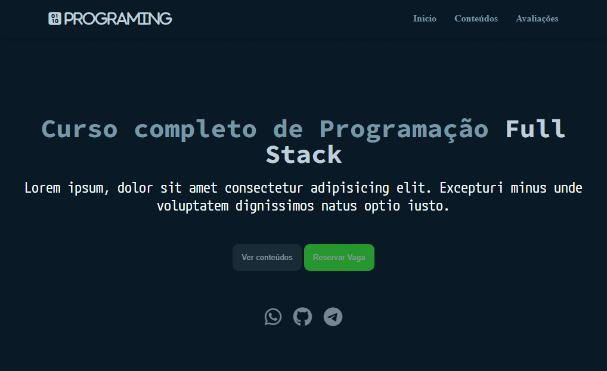
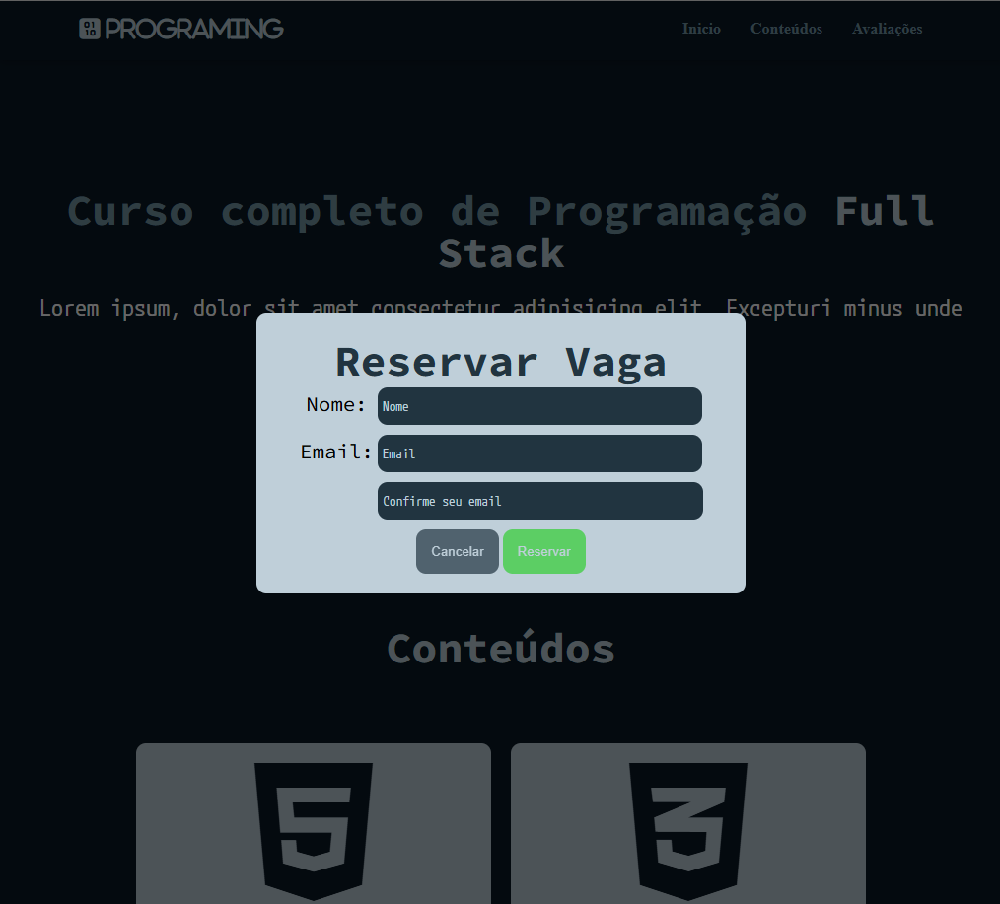
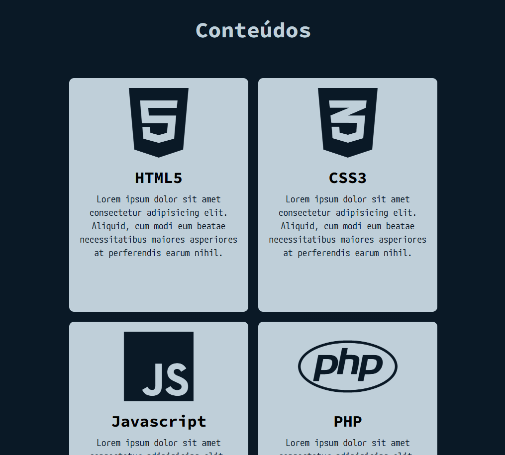
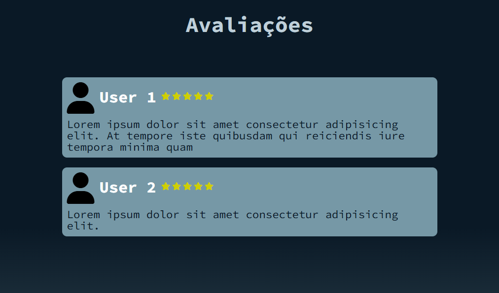

# Landing Page Curso - Programação Full Stack

## Descrição
Esta é uma landing page simples para "promover" um **curso completo de programação Full Stack**. O layout é responsivo e utiliza tecnologias básicas da web como HTML, CSS, JavaScript e PHP. Inclui seções de introdução, conteúdos do curso, avaliações de usuários, e botões de chamada para ação.

---

## Demonstração
Link para Demonstração






---

## Arquivos Principais
- **`index.html`**: Estrutura base da página.
- **`src/styles/style.css`**: Estilos personalizados da página.
- **`src/js/scripts.js`**: Scripts para funcionalidades da página.
- **`src/php/script.php`**: Scripts para o envio de Emails.
- **Font Awesome**: Biblioteca para ícones (link CDN incluído no projeto).

---

## Funcionalidades
1. **Menu Responsivo:**
   - Um botão alterna entre mostrar e ocultar o menu no mobile.

2. **Seção de Destaque (Home):**
   - Apresentação do curso com texto introdutório, botões de ação e links para redes sociais.

3. **Seção de Conteúdos:**
   - Destaque para as principais tecnologias ensinadas (HTML5, CSS3, JavaScript, PHP e MySQL).

4. **Seção de Avaliações:**
   - Testemunhos de usuários com sistema de avaliação por estrelas.

5. **Verificação de Formulário:**
   - Validação de nome e email com mensagens de erro interativas.

6. **Envio de Email:**
   - Sistema de envio de emails via backend PHP.

7. **Rodapé:**
   - Créditos e links para redes sociais.

---

## Tecnologias Utilizadas
- **HTML5** - Estruturação da página.
- **CSS3** - Estilização e layout responsivo.
- **Javascript** - Funcionalidades interativas.
- **PHP** - Backend para envio de emails.
- **Font Awesome** (para ícones).

---

## Pré-requisitos
- Um navegador atualizado (Google Chrome, Mozilla Firefox, etc.).
- Conexão com a internet para carregar os ícones via CDN.

---

## Instalação e Uso

1. **Clone ou baixe o repositório:**
   ```bash
   git clone https://github.com/Samuel-Nun3s/Landing-Page-Curso.git

2. **Abra o arquivo **`index.html`** em seu navegador.**

3. **Configuração do Backend:**
   - Certifique-se de ter um servidor PHP configurado para o envio de emails.

## Scripts e Funções

- **`changeMenu`**: Alterna a visibilidade do menu em dispositivos móveis.
- **`toggleModal`**: Abre e fecha o modal com formulário.
- **`verificationName`**: Faz a verificação se o nome de usuário foi inserido de forma correta.
- **`verificationEmail`**: Faz a verificação se o email do usuário foi inserido de forma correta.
- **`verificationConfirmEmail`**: Faz a verificação se a confirmação do email foi inserida igual a primeira caixa de email.
- **`setError`**: Insere mensagem de erro caso as informações estejam erradas.
- **`removeError`**: Retira a mensagem de erro caso as informações estejam certas.
- **`ReservePlace`**: Faz a verificação se os campos (nome,email) não estao vazios, e cria o objeto **"User"**.
- **`SendEmail`**: Faz a requisição ao backend **PHP** para o envio do email.

## Personalização
- Estilos: Modifique o arquivo **`src/styles/style.css`** para alterar cores, fontes ou layout.
- Conteúdo: Atualize o arquivo **`index.html`** para personalizar textos e links.
- Scripts: Adicione ou edite funcionalidades no arquivo **`src/js/scripts.js`**.
